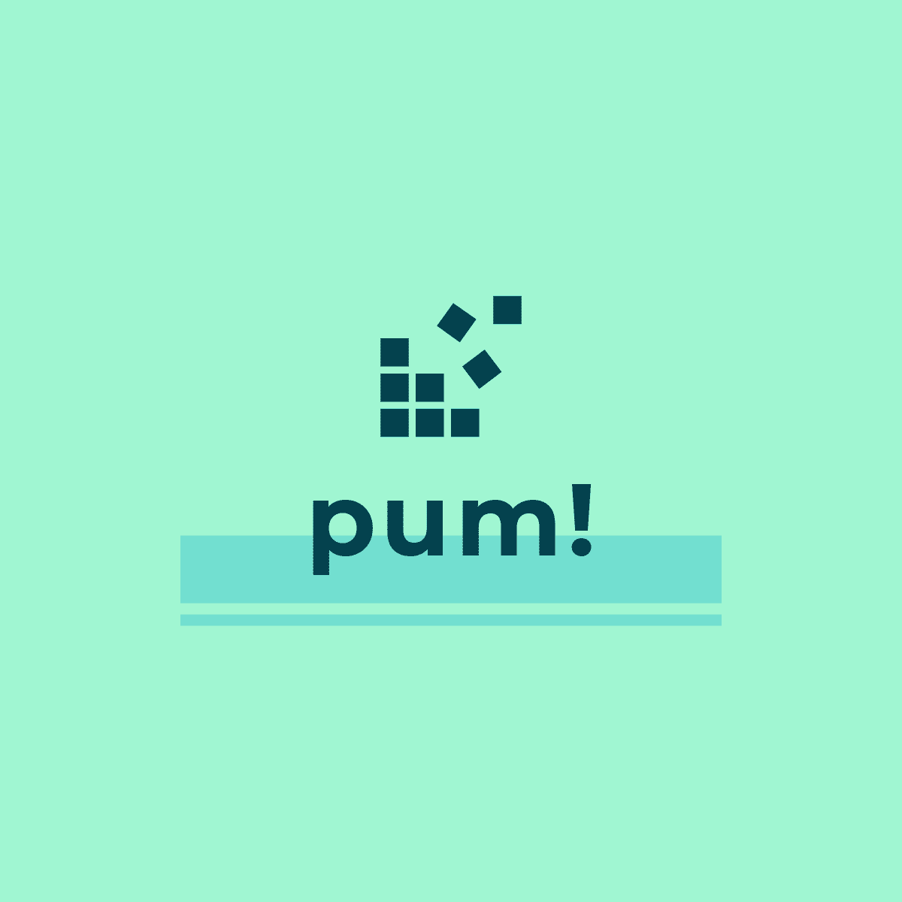

# Welcome to **pum!** Repository 

This repository contains the code we used for the "Nightingale Contest Spain" created by [@RLadiesBIO](https://twitter.com/RLadiesBIO) (https://github.com/rladies/spain_nightingale/).

Repository managed by Marta Bofill ([@martabofillr](https://twitter.com/martabofillr)), Guillermo Villacampa ([@G_Villacampa](https://twitter.com/G_Villacampa)) and Pol Castellano ([@polcastellano_](https://twitter.com/polcastellano_)).      

## Run Local

1) Clone this repository on your computer.
2) Make sure that you have all packages included in `helpers.R` installed on your machine.
3) Run `app.R` file and enjoy **pum!**.

## shinyapps.io Version

Please visit http://polcastellano.shinyapps.io/PUMapp to see a PUM's running version.   

## Code of Conduct

Please note that the PUM project is released with a [Contributor Code of Conduct](https://contributor-covenant.org/version/2/0/CODE_OF_CONDUCT.html). By contributing to this project, you agree to abide by its terms.     

## License

MIT &copy; Marta Bofill Roig, Pol Castellano Escuder, Guillermo Villacampa Javierre
